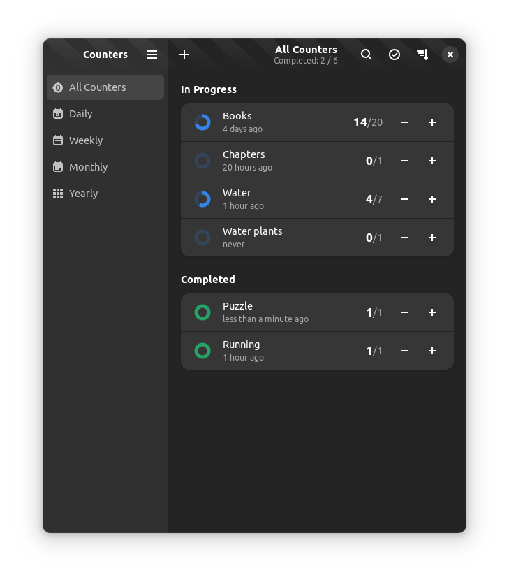

# Counters

A simple counter application

<div align="center">

</div>

## Building

You can build Counters with Gnome Builder, just clone the project and hit the run button.

### Requirements

- `gjs >= 1.54.0`
- `gtk4 >= 4.5`
- `libadwaita >= 1.5.0`
- `sqlite3`
- `meson >= 0.50`
- `ninja`
- `vala`
- `typescript`
- `gobject-introspection`
- `blueprint-compiler >= 0.10`

### Building with Meson

```bash
git clone https://gitlab.com/guillermop/counters.git
cd counters
meson . _build --prefix=/usr
ninja -C _build all
sudo ninja -C _build install
```
